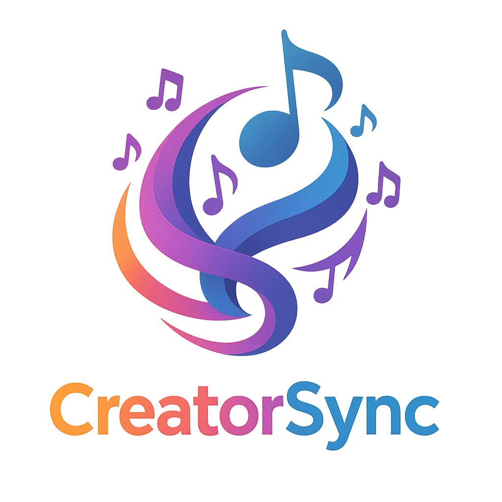
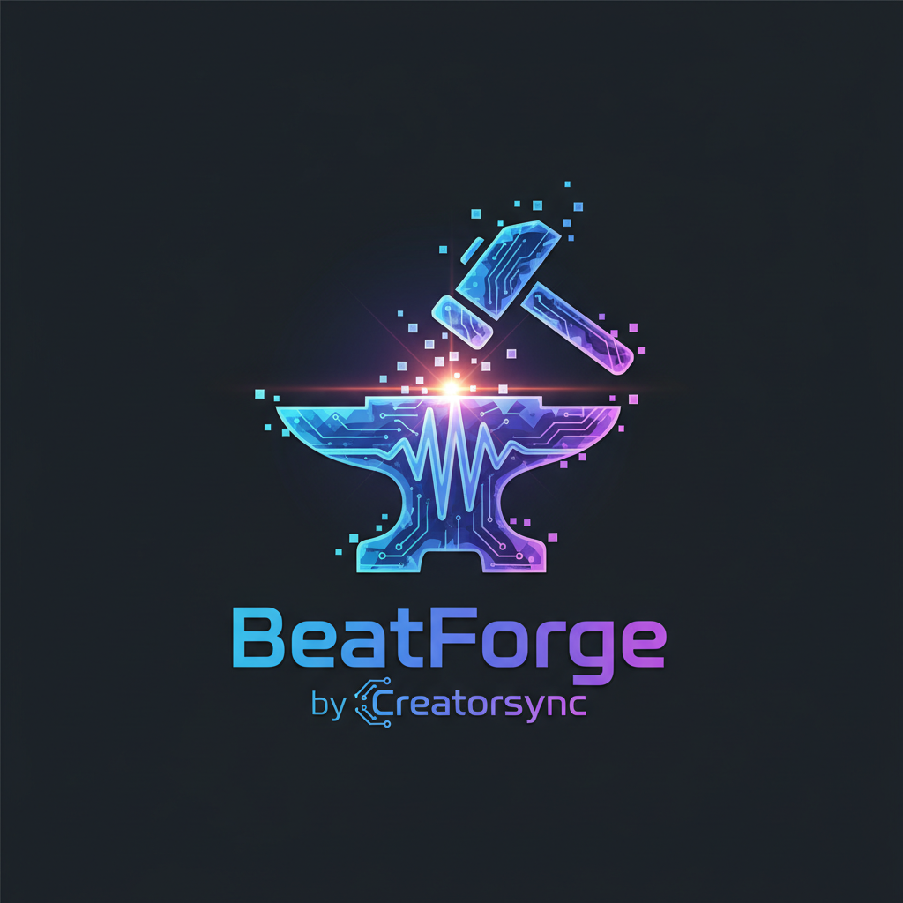

# Welcome to CreatorSync 🎵

Hey there, music producers! 🎧 Welcome to CreatorSync, your all-in-one platform for creating, collaborating, and selling beats. Whether you're a seasoned pro or just starting out, we've got everything you need to turn your musical ideas into reality—and profit!

## What is CreatorSync?

CreatorSync is like your favorite studio, marketplace, and jam session all rolled into one. It's a professional-grade beat maker, a bustling marketplace, and a real-time collaboration hub—all accessible right from your browser. No downloads, no expensive software, no hassle.

Our mission? To simplify your workflow so you can focus on what you do best: making amazing music. 🎶

## Why You'll Love It 💖

### 🎹 Beat Production Made Easy

Create beats like a pro with our intuitive tools:
- **Piano Roll Editor**: Perfect your melodies and drum patterns with precision.
- **Multi-Track Sequencing**: Layer your tracks for that rich, full sound.
- **MIDI Controller Support**: Plug in your gear and jam away.
- **Audio Effects**: Add EQ, reverb, delay, and more to polish your sound.
- **Automation**: Bring your tracks to life with dynamic changes over time.

### 🤝 Real-Time Collaboration

Why work alone when you can jam with friends? Collaborate with other producers in real-time. See their edits, share ideas, and create magic together. Whether you're across the street or across the globe, CreatorSync keeps you connected.

### 💰 Sell Your Beats

Turn your passion into profit with our integrated marketplace. Set your prices, define your licensing terms, and let buyers preview and purchase your beats. It's never been easier to share your music with the world—and get paid for it.

### 📺 Stream Your Process

Show off your skills and build your fanbase by streaming your creative process live on Twitch or YouTube. Engage with your audience, teach your techniques, or just vibe out while you work.

## Why CreatorSync?

Music production can be messy. Different tools for different tasks, endless file transfers, and a lot of wasted time. CreatorSync brings it all together in one seamless platform. It's fast, it's fun, and it just works.

So what are you waiting for? Dive in and start creating! 🚀
